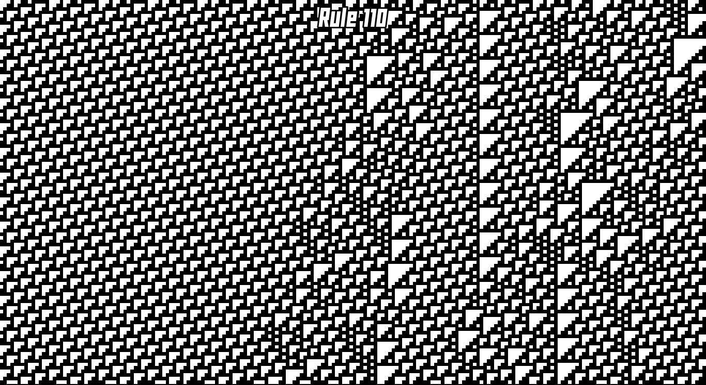

<h1>One Dimensional Cellular Automata</h1>
This is a program that can simulate all of the possible rules of 2 neighbour 1 dimensional cellular automata

<h4>Installation:</h4>
run make to compile
./rule110 <width> to run 
you can also specify a rule 
./rule110 <width> <rulenumber> 
rules range from 0 to 255

<h4>Controls:</h4>
space to pause (you need to hold it) 
enter to change to a random rule 
k to randomize current rule 
l to set only the rightmost cell to black

<h4>Dependencies:</h4>
sdl

